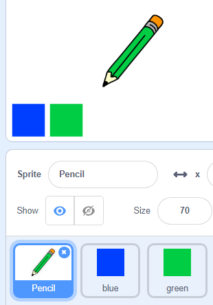

## Бојице

Сада ћеш у свој пројекат додати бојице различитих боја и омогућити кориснику да изабере ону коју жели.

\--- task \--- Кликни на лик оловке, а затим на **Костими** и умножи костим 'бојица-плава'.

 \--- /task \---

\--- task \--- Назови нови костим 'бојица-зелена' и обоји бојицу у зелено.


\--- /task \---

\--- task \--- Нацртај два нова лика: плави квадрат и зелени квадрат. Они служе за одабир између плаве и зелене оловке.

 \--- /task \---

\--- task \--- Преименуј их тако да се зову 'плава' и 'зелена'

[[[generic-scratch3-rename-sprite]]]

\--- /task \---

\--- task \--- Додај следећи код лику 'зелена', тако да кад је кликнуто на овај лик, он `разгласи`{:class="block3events"} поруку "зелена".


```blocks3
when this sprite clicked
broadcast (green v)
```

[[[generic-scratch3-broadcast-message]]] \--- /task \---

Лик оловке би требало да чека на поруку "зелена" и да промени костим и боју оловке као одговор.

\--- task \--- Врати се на лик оловке. Додај код, тако да, када овај лик прими разглас `зелена`{:class="block3events"}, промени костим у бојица-зелена и боју бојице у зелену.


```blocks3
when I receive [green v]
switch costume to (pencil-green v)
set pen color to [#00CC44]
```

Да подесиш бојицу да боји у зелену, кликни на обојени квадрат у блоку `нека боја оловке буде`{:class="block3extensions"}, а затим кликни на лик зеленог квадрата. \--- /task \---

Затим на сличан начин то уради и са плавом бојицом.

\--- task \--- Кликни на плави квадрат и додај следећи код:


```blocks3
when this sprite clicked
broadcast (blue v)
```

Then click on the pencil sprite and add this code: 

```blocks3
when I receive [blue v]
switch costume to (pencil-blue v)
set pen color to [#0000ff]
```

\--- /task \---

\--- task \--- На крају, додај овај код да кажеш лику бојице са којом бојом да почне и да екран буде обрисан када се твој програм покрене.


```blocks3
when flag clicked
+erase all
+switch costume to (pencil-blue v)
+set pen color to [#0035FF]
forever
  go to (mouse pointer v)
if <mouse down?> then
  pen down
  else
  pen up
end
```

\--- /task \---

Ако желиш, можеш почети са бојицом друге боје.

\--- task \--- Испробај свој код. Можеш ли да мењаш између плаве и зелене бојице када кликнеш на ликове плавог или зеленог квадрата?

 \--- /task \---