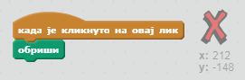

## Грешке

Понекад се дешавају грешке, па хајде да додамо дугме 'обриши' и гумицу.

+ Додај лик 'Х-блок'. Наћи ћеш га у библиотеци, у одељку "Слова". Обоји костим у црвено. То ће постати дугме 'обриши'.


+ Додај код овом лику да обрише позорницу када се кликне на њега.



Notice that you don't need to send a message to clear the stage, you can just use the clear block from this sprite.

Вероватно си приметио/ла да твој лик оловке има костим гумице:


+ Твој пројекат такође има посебан лик гумице. Кликни десним тастером миша на њега и изабери 'прикажи'. Твоја позорница би требало да изгледа овако:


+ Add code to the eraser sprite, to tell the pencil to switch to an eraser when the sprite is clicked.


When the pencil receives the "eraser" message, you can switch the pencil costume to the eraser, and switch the pencil colour to white - the same colour as the stage!

+ Add some code to create the eraser

\--- hints \--- \--- hint \--- Add some code to the pencil sprite: **When I receive** the **eraser** message **Switch to costume** eraser **Set pen color** to white \--- /hint \--- \--- hint \--- Here is how the code inside the pencil sprite should look:

```blocks
when I receive [eraser v]
switch costume to [eraser v]
set pen color to [#FFFFFF]
```

\--- /hint \--- \--- /hints \---

+ Test your project, to see if you can clear and erase on the stage.


There's one more problem with the pencil - you can draw anywhere on the stage, including near the selector icons!


To fix this, tell the pencil only to draw if the mouse is clicked *and* if the y-position of the mouse is greater than -120:


+ Test your project; you now shouldn't be able to draw near the selector blocks.

