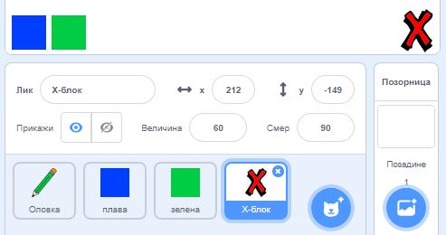
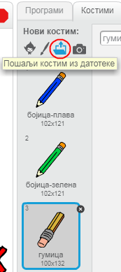

## Поништи грешке

Понекад се дешавају грешке, па хајде да додамо дугме 'обриши' и дугме за гумицу.

\--- task \--- Додај лик 'Блок-Х' из области слова у библиотеци. Обоји костим лика у црвено и смањи му величину. Овај лик је дугме 'обриши'.

[[[generic-scratch3-sprite-from-library]]]

 \--- /task \---

\--- task \--- Додај код лику 'блок-Х' да очистиш Позорницу кад је кликнуто на лик.


```blocks3
када је кликнуто на овај лик :: events
обриши :: pen
```

\--- /task \---

Не мораш да користиш блок `разгласи`{:class="block3events"} да би очистио Позорницу, зато што то може да уради блок `обриши све`{:class="block3extensions"}.

Да ли примећујеш да лик оловке садржи и костим гумице?



Твој пројекат такође има посебан лик гумице.

\--- task \--- Кликни десним тастером миша на лик а затим кликни на **прикажи**. Твоја позорница би сада требало да изгледа овако:

 \--- /task \---

\--- task \--- Додај код лику гумице, да би послао `разглас 'гумица'`{:class="block3events"} када је кликнуто на лик гумице.


```blocks3
када је кликнуто на овај лик :: events
разгласи (гумица v) :: events
```

\--- /task \---

Када оловка прими поруку "гумица", требало би да замени костим оловке са костимом гумице, а боју бојице у белу - исту боју као боју позорнице!

\--- task \--- Додај код за креирање гумице.

\--- hints \--- \--- hint \--- Додај следећи код лику оловке: `Када примим`{:class="block3events"} поруку `гумица`{:class="block3events"} `Замени костим са гумица`{:class="block3looks"} `Нека боја оловке буде`{:class="block3extensions"} бела \--- /hint \--- \--- hint \--- Ево свих блокова који су ти потребни:

```blocks3
нека боја оловке буде [#FFFFFF] :: pen

када примим [гумица v] :: events

замени костим са (гумица v) :: looks
```

\--- /hint \--- \--- hint \--- Овако би код требало да изгледа: 

```blocks3
када примим [гумица v] :: events
замени костим са (гумица v) :: looks
нека боја оловке буде [#FFFFFF] :: pen
```

\--- /hint \--- \--- /hints \--- \--- /task \---

\--- task \--- Испробај свој пројекат и провери да ли можеш да очистиш Позорницу и избришеш линије оловке.

 \--- /task \---

Постоји још један проблем са оловком - можеш да црташ било где на Позорници, укључујући и близу дугмета 'обриши' и дугмета за гумицу!


\--- task \--- Да ово поправиш, промени код тако да оловка црта само када је кликнуто на тастер миша **и** када је `y` позиција показивача миша изнад `-120`:


```blocks3
када је кликнуто на ⚑ :: events
обриши :: pen
замени костим са (бојица-плава v) :: looks
нека боја оловке буде [#0035FF] :: pen
понављај 
  иди до (показивач миша v) :: motion
  + ако је <<миш притиснут?> и <(миш y :: sensing) > [-120] :: operators> :: operators> онда 
  +   спусти оловку :: pen
  + 
  +   подигни оловку :: pen :: control
  + end :: control
end
```

\--- /task \---

\--- task \--- Испробај свој пројекат. Сада не би требало да будеш у могућности да црташ у близини дугмади.

 \--- /task \---