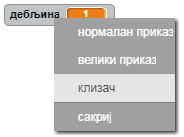
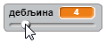

## Промени дебљину оловке

Сада ћеш додати код, који ће омогућити кориснику; да црта ствари са оловкама разних величина.

\--- task \--- Прво додај нову променљиву која ће се звати `дебљина`{:class="block3variables"}.

[[[generic-scratch3-add-variable]]] \--- /task \---

\--- task \--- Додај ову наредбу **унутар** петље `понављај`{:class="block3control"} у коду оловке:

```blocks3
када је кликнуто на ⚑ :: events
обриши :: pen
замени костим са (бојица-плава v) :: looks
нека боја оловке буде [#0035FF] :: pen
понављај 
  иди до (показивач миша v) :: motion
  + нека дебљина оловке буде (дебљина :: variables) :: pen
  ако је <&lt;mouse down?&gt; и <(миш y :: sensing) > [-120] :: operators> :: operators> онда 
    спусти оловку :: pen
  
    подигни оловку :: pen :: control
  end :: control
end
```

\--- /task \---

Ширина трага оловке сада ће стално бити постављена на вредност променљиве `дебљина`{:class="block3variables"}.

\--- task \--- Кликни десним тастером миша на променљиву `дебљина`{:class="block3variables"} приказану на Позорници, а затим кликни на **клизач**.

 \--- /task \---

Сада можеш да помераш клизач који се налази испод променљиве да би променио њену вредност.



\--- task \--- Испробај свој пројекат и провери да ли можеш да додаш код за подешавање дебљине оловке.

 \--- /task \---