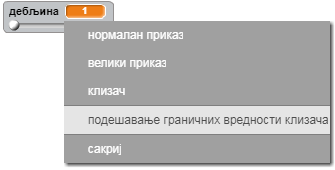

## Промена дебљине оловке

Хајде да омогућимо кориснику да црта користећи оловке различитих дебљина.

+ Прво додај нову променљиву која ће се звати `дебљина`{:class="blockvariable"}.

[[[generic-scratch-add-variable]]]

+ Додај ову наредбу *унутар* петље `понављај`{:class="blockcontrol"} у коду оловке:

```blocks
    нека дебљина оловке буде (дебљина)
```

Дебљина оловке сада ће бити увек постављена на вредност променљиве 'дебљина'.

+ Кликни десним тастером миша на променљиву приказану на позорници и кликни на 'клизач'.


Сада можеш да помераш клизач испод променљиве да промениш њену вредност.


+ Испробај пројекат и провери да ли можеш да промениш дебљину бојице.


Ако желиш, можеш да поставиш најмању и највећу дозвољену вредност 'дебљине'. Да би то урадио, поново кликни десним тастером миша на променљиву, а затим кликни на 'подешавање граничних вредности клизача'. Подеси најмању и највећу вредност променљиве, на пример 1 и 20.



Настави да испробаваш променљиву 'дебљина' док не будеш задовољан/а.