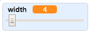

## Промени дебљину оловке

Сада ћеш додати код, који ће омогућити кориснику; да црта ствари са оловкама разних величина.

\--- task \---

First, add a new variable called `width`{:class="block3variables"}.

[[[generic-scratch3-add-variable]]]

\--- /task \---

\--- task \---

Add this line **inside** the `forever`{:class="block3control"} loop of the pencil sprite's code:

```blocks3
када је кликнуто на ⚑
обриши све
замени костим са (бојица-плава v)
нека боја оловке буде [#0035FF]
понављај заувек 
  иди до (показивач миша v)
  + нека дебљина оловке буде (дебљина :: variables)
  ако је <<mouse down?> и <(миш y) > [-120]>> онда 
    спусти оловку
  у супротном 
    подигни оловку
  end
end
```

\--- /task \---

The pen width now repeatedly gets set to the value of the `width`{:class="block3variables"} variable.

\--- task \---

Right-click on the `width`{:class="block3variables"} variable displayed on the Stage, and then click on **slider**.


\--- /task \---

You can now drag the slider that is visible below the variable to change the variable's value.



\--- task \---

Test your project and see if you can add code to adjust the pen width.


\--- /task \---