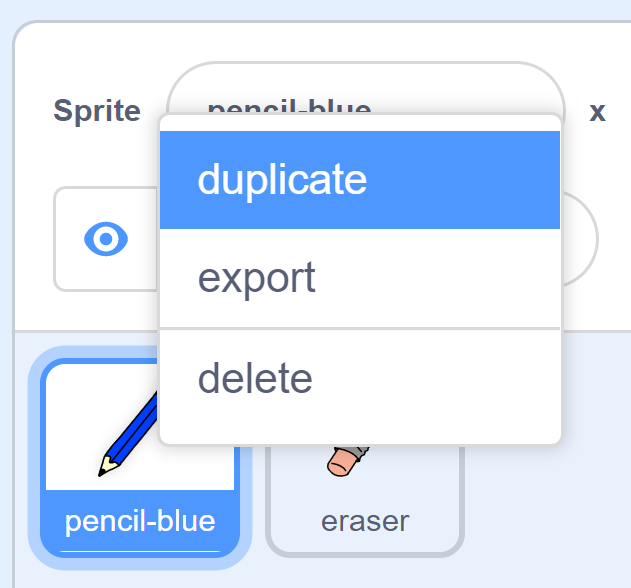

## வண்ண பென்சில்கள்

இப்போது நீங்கள் உங்கள் திட்டத்தில் வெவ்வேறு வண்ண பென்சில்களைச் சேர்த்து, அவற்றில் ஒன்றை பயனரைத் தேர்வுசெய்ய அனுமதிக்கப் போகிறீர்கள்.

\--- / பணி \---

`Pencil`(பென்சில்) sprite-ஐ `pencil-blue`(பென்சில்-நீலம்) என்று மறுபெயரிடுக


\--- / பணி \---

\--- / பணி \---

பென்சில் sprite-இல் வலது கிளிக் செய்து, 'pencil-blue' costume-ஐ நகலெடுக்கவும்(duplicate).



\--- / பணி \---

\--- / பணி \---

புதிய costume-க்கு 'pencil-green'(பென்சில்-பச்சை) என்று பெயரிட்டு, பென்சிலுக்கு பச்சை நிற வண்ணம் பூசவும்.


\--- / பணி \---

\--- / பணி \---

இரண்டு புதிய spite-களை வரையவும்: ஒரு நீல சதுரம் மற்றும் ஒரு பச்சை சதுரம். இவை நீலம் மற்றும் பச்சை பென்சிலுக்கு இடையில் தேர்ந்தெடுப்பதற்கானவை.


\--- / பணி \---

\--- / பணி \---

புதிய sprite-களுக்கு 'blue'(நீலம்) மற்றும் 'green'(பச்சை) என்று மறுபெயரிடுங்கள்

[[[generic-scratch3-rename-sprite]]]

\--- / பணி \---

\--- / பணி \---

'Green' sprite-இல் சில குறியீட்டைச் சேர்க்கவும், இதனால் இந்த sprite-ஐக் கிளிக் செய்யும் போது, அது "green" என்ற செய்தியை ஒலிபரப்பும்(`broadcasts`{:class="block3events"})


```blocks3
when this sprite clicked
broadcast (green v)
```

[[[generic-scratch3-broadcast-message]]]

\--- / பணி \---

பென்சில் sprite, "green" செய்தியைக் கேட்டு, அதன் costume மற்றும் பென்சிலின் நிறத்தை மாற்ற வேண்டும்.

\--- / பணி \---

உங்கள் பென்சில் sprite-க்கு மாறவும். சில குறியீட்டைச் சேர்க்கவும், இதனால் இந்த sprite-க்கு `green` {: class = "block3events"} ஒலிபரப்பு கிடைக்கும்போது, அது பச்சை பென்சில் costume-க்கு மாறுகிறது மற்றும் பேனா நிறத்தை பச்சை நிறமாக மாற்றுகிறது.


```blocks3
when I receive [green v]
switch costume to (pencil-green v)
set pen color to [#00CC44]
```

பென்சில் நிறத்தை பச்சை நிறமாக அமைக்க, `set pen color`{:class="block3extensions"} தொகுதியில் உள்ள வண்ண சதுரத்தை கிளிக் செய்து, பின்னர், பச்சை சதுர sprite-ஐ கிளிக் செய்யவும்.

\--- / பணி \---

பின்னர், பென்சில் நிறத்தை நீலமாக மாற்ற, மேலே சொன்ன படிகளைப் போலவே மீண்டும் செய்யவும்.

\--- / பணி \---

நீல சதுர sprite-ஐக் கிளிக் செய்து இந்த குறியீட்டைச் சேர்க்கவும்:


```blocks3
when this sprite clicked
broadcast (blue v)
```

பின்னர் பென்சில் sprite-ஐக் கிளிக் செய்து இந்த குறியீட்டைச் சேர்க்கவும்:


```blocks3
when I receive [blue v]
switch costume to (pencil-blue v)
set pen color to [#0000ff]
```

\--- / பணி \---

\--- / பணி \---

இறுதியாக, பென்சில் sprite எந்த நிறத்துடன் தொடங்க வேண்டும் என்பதைக் கூறவதற்கும், உங்கள் நிரல் தொடங்கும் போது திரையில் ஏதும் இல்லாமல், தெளிவாக இருப்பதை உறுதிப்படுத்துவதற்கும் இந்த குறியீட்டைச் சேர்க்கவும்.


```blocks3
when flag clicked
+erase all
+switch costume to (pencil-blue v)
+set pen color to [#0035FF]
forever
  go to (mouse pointer v)
if <mouse down?> then
  pen down
  else
  pen up
end
```

\--- / பணி \---

நீங்கள் விரும்பினால், நீங்கள் வேறு வண்ண பென்சிலுடன் தொடங்கலாம்.

\--- / பணி \---

உங்கள் குறியீட்டை சோதிக்கவும். நீலம் அல்லது பச்சை சதுர sprite-களைக் கிளிக் செய்வதன் மூலம் நீலம் மற்றும் பச்சை பென்சில் வண்ணங்களுக்கு இடையில் நீங்கள் மாற முடிகிறதா?


\--- / பணி \---