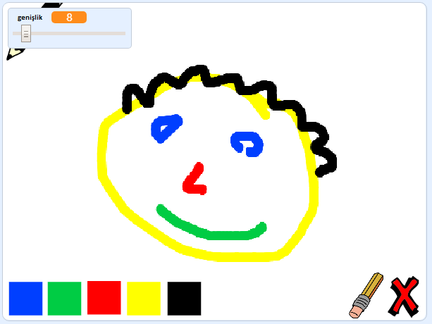

\--- no-print \---

Bu, projenin **Scratch 3** versiyonudur. Ayrıca projenin</a>bir Scratch 2 versiyonu da bulunmaktadır.
 

\--- /no-print \---

## Giriş

Kendi paint programınızı yapın!

### Ne yapacaksınız

\--- no-print \--- Başlamak için yeşil bayrak üzerine tıklayın. Kalemi hareket ettirmek için fareyi kullanın ve çizmek için farenin sol düğmesini basılı tutun. Kalemleri değiştirmek için bir renge tıklayın. Değiştirmek için silgiyi tıklayın ve çalışmanızı silmek için kullanın. Sayfayı temizlemek için haçı tıklayın.

  <iframe allowtransparency="true" width="485" height="402" src="//scratch.mit.edu/projects/embed/267243161/?autostart=false" frameborder="0" scrolling="no"></iframe>
  

\--- /no-print \---

\--- sadece baskı \--- Başlamak için yeşil bayrağa tıklayacaksınız ve kalemi taşımak için fareyi kullanacak ve çizim yapmak için farenin sol düğmesini basılı tutunuz. Bir renge tıklamak kurşun kalem rengini değiştirir ve silgiyi tıklatmak silgiye dönüşür!

 \--- /print-only \---

## \--- collapse \---

## title: Ne öğreneceksiniz

+ Add the pen extension in Scratch
+ Use broadcasts to control a sprite in Scratch
+ Recall how to respond to mouse events in Scratch \--- /collapse \---

## \--- collapse \---

## title: Nelere ihtiyacınız var

### Donanım

+ Scratch 3 çalıştırabilen bir bilgisayar

### Yazılım

+ Scratch 3 ([çevrimiçi](http://rpf.io/scratchon){:target="_blank"} veya [çevrimdışı](http://rpf.io/scratchoff){:target="_blank"})

### İndirilenler

+ [Çevrimdışı başlangıç projesi](http://rpf.io/p/en/paint-box-go){: target = "_ blank"}

\--- /collapse \---

## \--- collapse \---

## title: Eğitimciler için ek bilgiler

Bu projeyi yazdırmanız gerekiyorsa lütfen [yazıcı-dostu sürümü](https://projects.raspberrypi.org/en/projects/paint-box/print){:target="_blank"} kullanın.

Sen edebilir [Burada bu proje için çözüm bulmak](http://rpf.io/p/en/paint-box-get){: target = "_ blank"}. \--- /collapse \---