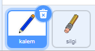
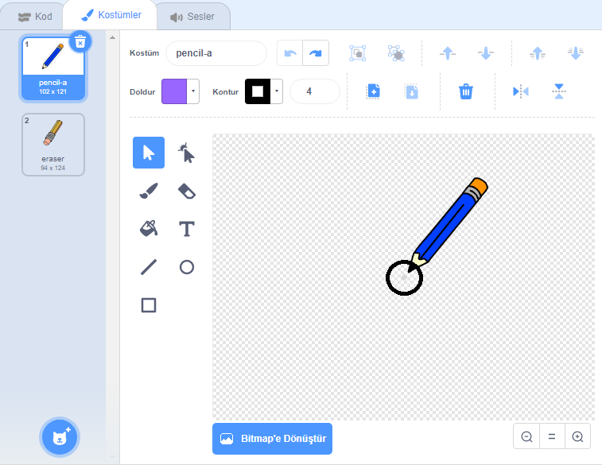

## Kalem yapmak

Sahne Alanı'nda çizmek için kullanabileceğiniz bir kalem yaparak başlayın.

\--- görev \--- 'Çizim kutusu' Çizilmeye başlama projesini açın.

**Çevrimiçi**: başlangıç projesini [rpf.io/paint-box-on](http://rpf.io/paint-box-on){: target = "_ blank"}

Eğer bir Scratch hesabınız varsa, **Remix**'e tıklayarak bir kopya oluşturabilirsiniz.

** Çevrimdışı**: [başlangıç projesini](http://rpf.io/p/en/paint-box-go) Çevrimdışı düzenleyicide {: target = "_ blank"} açın.

Scratch çevrimdışı düzenleyicisini indirip yüklemeniz gerekirse, bunu [ rpf.io/scratchoff adresinde bulabilirsiniz. ](http://rpf.io/scratchoff) {: Hedef = "_ blank"}

Başlangıç projesinde kurşun kalem ve silgi spritelarını görmelisiniz:

 \--- /task \---

\--- task \---

Kalem uzantısını projenize ekleyin.

[[[generic-scratch3-add-pen-extension]]]

\--- /task \---

\--- task \---

Add some code to the pencil sprite to make the sprite follow the mouse pointer `forever`{:class="block3control"} so that you can draw:


```blocks3
bayrak
sonsuza kadar
  tıklatıldığında, (fare işaretçisi v)
son
```

\--- /task \---

\--- task \--- Click the flag and then move the mouse pointer around the Stage to test whether your code works. \--- /task \---

Şimdi, sadece fareye tıklanmış `ise`{:class = "blockcontrol"} kalemin ekranda çizim yapmasını sağlayalım.

\--- task \--- Add this code to your pencil sprite:


```blocks3
Bayrak tıklandığında
sonsuza
  (fare işaretçisi v) için gitmek

+ halinde <mouse down?> daha sonra
  kalem aşağı
  başka bir
  kalemi
uç
```

\--- /task \---

\--- task \--- Test your code again. This time, move the pencil around the Stage and hold down the mouse button. Kaleminle çizim yapabiliyor musun?

 \--- /task \---

## \--- collapse \---

## title: Kalemin ucundan çizmiyor mu?

Kaleminizin çizdiği çizgi kalemin ortasından geliyor gibi görünüyorsa, kalem sprite'larınızı değiştirmeniz gerekir, böylece ucu sprite'nın merkezi olur.

Kalem spritesine ve ardından **Costumes** sekmesine tıklayın.

Move the costume's so the tip of the pencil is **just above** the centre.



Now move the pencil around on the Stage and draw. The pencil should now draw a line from its tip.

\--- /collapse \---