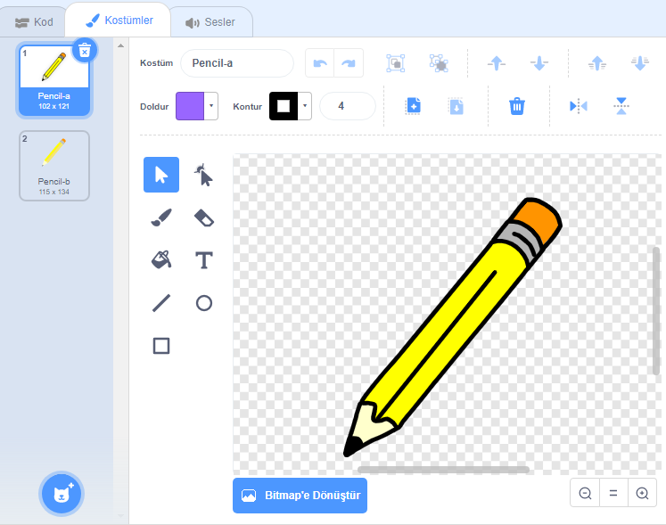

## Bir kalem yapmak

Haydi ekranda çizim yapmak için kullanılabilecek bir kalem yaparak başlayalım.

+ 'Paintbox' Scratch projesini çevrimiçi olarak [jumpto.cc/paint-go](http://jumpto.cc/paint-go){: target = "_ blank"} adresinden açın veya <http://jumpto.cc/paint-get>{: target = "_ blank"} adresinden indirerek, çevrimdışı düzenleyiciyi ile açın.

Kalem ve silgi kuklalarını göreceksiniz:


+ Kalem kuklasına bazı kodlar ekleyerek, fareyi takip etmesini `sürekli tekrarla`{: class = "blockcontrol"}'yalım. Böylece kalemle çizim yapabiliriz:

```blocks
    yeşil bayrak tıklandığında
sürekli tekrarla 
  [fare oku v] 'na git
end
```

+ Bayrağa tıklayın ve ardından kodun çalışıp çalışmadığını test etmek için fareyi çizim ekranında hareket ettirin.

Sonra, sadece fareye tıklanmış `ise`{:class = "blockcontrol"} kalemin ekranda çizim yapmasını sağlayalım.

+ Kalem kuklasına bu kodu ekle:


+ Kodunuzu tekrar test edin. Bu kez, kalemi sahnenin etrafında hareket ettirin ve fare düğmesini basılı tutun. Kaleminle çizebilir misin?


## \--- çöküş \---

## başlık: Sorun yaşıyorsanız ...

Kaleminiz çizginin ucundan ziyade kalemin ortasından çiziyor gibi görünüyorsa, kostüm merkezinizi değiştirmeniz gerekecektir.



Kalem Artı yerleştirilmelidir **hemen altında** değil kalem ucu üzerine, kalem ucu.

Bir sprite'ın "kostüm merkezi" ndeki değişiklikler, başka bir sekme tıklanıncaya kadar kayıtlı değil, bu nedenle kostüm merkezinde değişikliklerinizi sonuçlandırmak için başka bir kostüm veya "Scripts" sekmesinde tıklayın.

\--- /çöküş \---