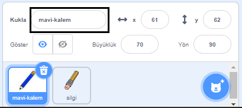
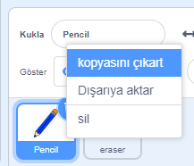
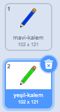
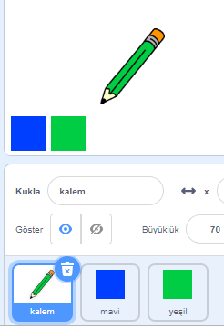

## Renkli kalemler

Şimdi projenize farklı renkli kalemler ekleyeceksiniz ve kullanıcının aralarından seçim yapmasına izin vereceksiniz.

\--- task \--- Kuklanın `kalem` olan adını `mavi-kalem` olarak değiştirin

 \--- /task \---

\--- task \--- Kalem üzerine sağ tuşla tıklayın ve mavi-kalem kostümünü çoğaltın.

 \--- /task \---

\--- task \--- Yeni kostümün adını yeşil-kalem olarak değiştirin ve kalemin rengini yeşil yapın.



\--- /task \---

\--- task \--- İki yeni kukla çizin: bir mavi kare ve bir yeşil kare. Bunlar mavi ve yeşil kalem arasında seçim yapmak için.

 \--- /task \---

\--- task \--- Kuklalarınızı 'mavi' ve 'yeşil' olarak yeniden isimlendirin

[[[generic-scratch3-rename-sprite]]]

\--- /task \---

\--- task \--- 'Yeşil' kuklanıza biraz kod ekleyerek, tıklandığında "yeşil" mesajını `yayınlayabilecektir`{:class="block3events"}.


```blocks3
bu kukla tıklandığında
(yeşil) haberini sal
```

[[[generic-scratch3-broadcast-message] \---

Kalem kuklası "yeşil" mesajı dinlemeli ve karşılık olarak kostümünü ve kalem rengini değiştirmelidir.

\--- task \--- Kalem kuklanıza geçiş yapın. Biraz kod ekleyerek; kuklanın `yeşil`{:class="block3events"} mesaj yayınını aldığında, yeşil kalem kostümüne geçiş yapmasını ve kalemin rengini yeşil olarak değiştirmesini sağlayın.


```blocks3
[yeşil] haberini aldığımda
(yeşil-kalem) kılığına geç
kalem rengini [#00CC44] yap
```

Kalemin rengini yeşil olarak ayarlamak için, renkli kare bloktaki `kalem rengini ayarla`{:class="block3extensions"} 'ya ardından da yeşil kare kuklaya tıklayın. \--- /task \---

Aynı şekilde kalemin rengini maviyle de değiştirebilirsin.

\--- task \--- Mavi kare kuklaya tıklayın ve şu kodu ekleyin:


```blocks3
bu kukla tıklandığında
(mavi) haberini sal
```

Ardından kalem kuklasına tıklayın ve şu kodu ekleyin: 

```blocks3
[mavi] haberini aldığımda
(mavi-kalem) kılığına geç
kalem rengini [#0000ff] yap
```

\--- /task \---

\--- görev \--- Son olarak, kalem kuklasına hangi renkle başlayacağını söyleyin ve programınız başladığında ekranın temiz olduğundan emin olmak için şu kodu ekleyin.


```blocks3
yeşil bayrak tıklandığında
tümünü sil
(pencil-blue v) kılığına geç
kalem rengini [#0035FF] yap
sürekli tekrarla 
  (mouse pointer v) 'e git
  eğer <mouse down?> ise 
    kalemi bastır
  değilse 
    kalemi kaldır
 end
```

\--- /task \---

İsterseniz farklı bir renkli kalemle de başlayabilirsiniz.

\--- task \--- Kodunuzu test edin. Mavi ya da yeşil kare kuklalara tıklayınca mavi ve yeşil renkli kalemler arasında geçiş yapabiliyor musunuz?

 \--- /task \---