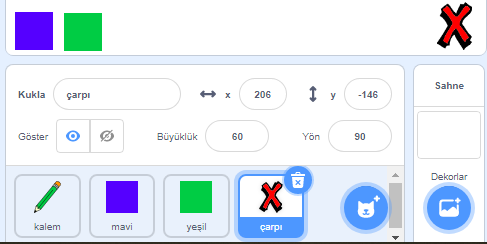
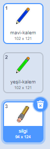
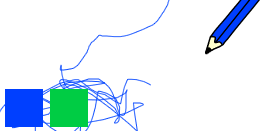

## Hataları geri al

Bazen hatalar olur, bu yüzden bir 'temizle' butonu ve bir silgi butonu ekleyin.

\--- görev \--- Kütüphanenin harfler bölümünden 'Çarpı' kuklası ekleyin. Kuklanın kostümünü kırmızıyla renklendirin ve biraz daha küçük hale getirin. Bu kukla 'temizle' düğmesidir.

[[[generic-scratch3-sprite-from-library]]]

 \--- /task \---

\--- task \--- 'Çarpı' kuklası tıklandığında Sahne Alanı'nı temizlemek için bu kodunu ekleyin.


```blocks3
bu kukla tıklandığında
tümünü sil
```

\--- /task \---

Sahne Alanı'nı temizlemek için `haber sal` kodunu kullanmanıza gerek yok; çünkü `tümünü sil`{: class = "block3extensions"} kodu işin hepsini yapacaktır.

Kalem kuklasının bir silgi kostümünü içerdiğini görüyor musunuz?



Projeniz ayrıca farklı bir silgi kuklası içerir.

\--- task \--- Silgi kuklasının üzerine sağ tıklayıp **göster** düğmesine basın. Şimdi Sahnenizin nasıl görünmesi gerektiğine bakın:

 \--- /task \---

\--- görev \--- Silgi kuklasına şu kodu, tıklandığında `'silgi' haberini yayınlaması`{: class = "block3events"} için ekleyin.


```blocks3
bu kukla tıklandığında
(silgi) haberini sal
```

\--- /task \---

Kalem kuklası 'silgi' mesajını aldığında, kostümünü silgiye dönüştürmeli ve kalem rengini Sahne Alanı'yla aynı renk olan beyazla değiştirmelidir!

\--- görev \--- Silgiyi oluşturmak için bir kod ekleyin.

\--- hints \--- \--- hint \--- Kalemkuklasına bazı kodlar ekleyin: ``{: class = "block3events"} aldığımda `silgisi`{: class = "block3events"} mesaj `Kostüm silgisine geç`{: class = "block3looks"} `Kalem rengini ayarla`{: class = "block3extensions"} 'ye beyaz \--- / ipucu \--- \--- ipucu \--- İşte ihtiyacınız olan tüm bloklar:

```blocks3
kalem rengini [#FFFFFF] yap

[silgi] haberini aldığımda

(silgi) kılığına geç
```

\--- /hint \--- \--- hint \--- Here is what the code should look like: İşte kod şu şekilde görünmelidir: 

```blocks3
[silgi] haberini aldığımda
(silgi) kılığına geç
kalem rengini [#FFFFFF] yap
```

\--- /hint \--- \--- /hints \--- \--- /task \---

\--- task \--- Sahne Alanı'nı temizleyip kalem çizgilerini silip silmediğinizi görmek için projenizi test edin.

 \--- /task \---

Kurşun kalemle ilgili bir sorun daha var: Sahne Alanı'nda 'Temizle' ve silgi düğmeleri de dahil her yeri çizebiliyorsunuz!



\--- task \--- Bunu düzeltmek için kodu değiştirin; böylece fare yalnızca tıklatıldığında **ve** fare işaretçisinin `y` konumu `-120` değerinden büyükse çalışsın:


```blocks3
yeşil bayrak tıklandığında
tümünü sil
(mavi-kalem) kılığına geç
kalem rengini [#0035FF] yap
sürekli tekrarla 
  (fare imleci) 'e git
  eğer <<mouse down?> ve <(farenin y'si) > [-120]>> ise 
    kalemi bastır
  değilse 
    kalemi kaldır
  end
```

\--- /task \---

\--- görev \--- Projenizi test edin. Şimdi düğmelerin yanına çizim yapamıyor olmanız gerekir.

 \--- /task \---