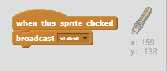

## Hata yapmak

Bazen hatalar olur, o zaman bir 'temiz' düğmesi ve bir silgi ekleyelim.

+ 'X-blok' hareketli grafiğini ekleyin - kütüphanede harflerin içinde bulabilirsiniz. Kostümleri kırmızıya boyayın. Bu 'açık' butona dönüşecek.


+ Tıklandığında sahneyi temizlemek için bu hareketli grafiğe kod ekleyin.


Sahneyi temizlemek için bir mesaj göndermeniz gerekmediğine dikkat edin, bu bloktan net bloğu kullanabilirsiniz.

Muhtemelen kalem kaleminizin bir silgi kostümü içerdiğini fark ettiniz:


+ Projeniz ayrıca ayrı bir silgi sprite içerir. Bu hareketli grafiğe sağ tıklayın ve 'show' seçeneğini seçin. Sahnenin nasıl göründüğü şöyle:


+ Sprite tıklandığında kalemin silgiye geçmesini söylemek için silgi grafiğine kod ekleyin.



Kalem "silgi" mesajını aldığında, kalem kostümü silgiye geçebilir ve kalem rengini beyaza dönüştürebilir - sahne ile aynı renkte!

+ Silgi oluşturmak için biraz kod ekleyin

\--- ipuçları \--- \--- ipucu \--- kalem sprite bazı kod ekleyin: **** aldığım zaman **silgi** mesaj **kostüm** silgi **ayarla kalem rengi** beyaz \--- / ipucu \--- \--- ipucu \--- İşte kalem sprite içindeki kod nasıl görünmelidir:

```blocks
[eraser v] anahtarını [eraser v] ürününe aldığımda kalem rengini [#FFFFFF] olarak ayarladım
```

\--- / ipucu \--- \--- / ipuçları \---

+ Sahneyi temizleyip silip atamayacağınızı görmek için projenizi test edin.


Kalemle bir sorun daha var - seçici simgelerin yakınında dahil, sahnenin herhangi bir yerinde çizim yapabilirsiniz!


Bunu düzeltmek için, yalnızca farenin y-konumu -120'den büyükse fare *ve* tıklandığında çizin.


+ Projenizi test edin; Şimdi seçici blokların yakınında çizemezsiniz.

