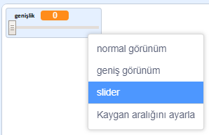
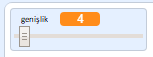

## Kalem genişliğini değiştirin

Sırada, programınızı kullanan kişinin nesneleri farklı kalem genişlikleriyle çizmesine izin veren kodu ekleyeceksiniz.

\--- task \---

First, add a new variable called `width`{:class="block3variables"}.

[[[generic-scratch3-add-variable]]]

\--- /task \---

\--- task \---

Add this line **inside** the `forever`{:class="block3control"} loop of the pencil sprite's code:

```blocks3
yeşil bayrak tıklandığında
tümünü sil
(mavi-kalem) kılığına geç
kalem rengini [#0035FF] yap
sürekli tekrarla 
  (fare imleci) 'e git
  kalem kalınlığını (genişlik) yap
  eğer <<mouse down?> ve <(fare y) > [-120]>> ise 
    kalemi bastır
  değilse 
    kalemi kaldır
 end
```

\--- /task \---

The pen width now repeatedly gets set to the value of the `width`{:class="block3variables"} variable.

\--- task \---

Right-click on the `width`{:class="block3variables"} variable displayed on the Stage, and then click on **slider**.



\--- /task \---

You can now drag the slider that is visible below the variable to change the variable's value.



\--- task \---

Test your project and see if you can add code to adjust the pen width.


\--- /task \---