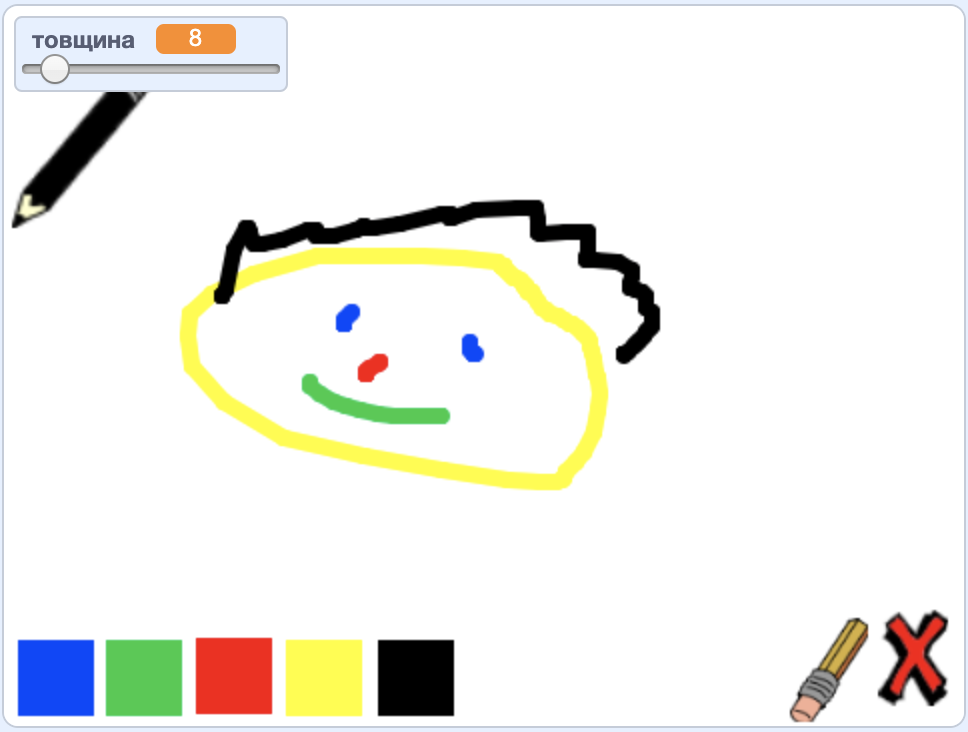

--- no-print ---

Це — версія проєкту для **Скретч 3**. Також існує [версія проєкту для Скретч 2](https://projects.raspberrypi.org/uk-UA/projects/paint-box-scratch2).

--- /no-print ---

## Вступ

Створи власну програму для малювання!

### Що ти зробиш

--- no-print ---

Натисни на зелений прапор для запуску. Використовуй мишку, щоб переміщувати олівець, і затискай ліву клавішу мишки, щоб малювати. Клацай на кольори, щоб міняти олівці. Клацни на гумку, щоб вибрати її, і використовуй її для стирання своєї роботи. Для очищення сторінки натисни на хрест.

  <iframe allowtransparency="true" width="485" height="402" src="//scratch.mit.edu/projects/embed/396602182/?autostart=false" frameborder="0" scrolling="no"></iframe>
  

--- /no-print ---

--- print-only ---

Ти клацнеш на зелений прапор для запуску, а потім використовуватимеш мишку, щоб переміщувати олівець, і затискатимеш ліву клавішу мишки для малювання. Натискання на кольори змінюватиме кольори олівців, а клацання на гумку вибиратиме натомість її!

--- /print-only ---

--- collapse ---
---
title: Чого ти навчишся
---
+ Додавати розширення Олівець у Скретч
+ Використовувати оповіщення для керування спрайтами в Скретч
+ Пригадаєш, як реагувати на події мишки у Скретч

--- /collapse ---

--- collapse ---
---
title: Що тобі знадобиться
---
### Обладнання

+ Комп'ютер, що підтримує Скретч 3

### Програмне забезпечення

+ Скретч 3 (або [онлайн](https://rpf.io/scratchon){:target="_blank"}, або [офлайн](https://rpf.io/scratchoff){:target="_blank"})

### Завантаження

+ [Початковий офлайн-проєкт](https://rpf.io/p/uk-UA/paint-box-go){:target="_blank"}

--- /collapse ---

--- collapse ---
---
title: Додаткова інформація для викладачів
---
Якщо вам потрібно роздрукувати цей проєкт, будь ласка, скористайтеся [версією для друку](https://projects.raspberrypi.org/uk-UA/projects/paint-box/print){:target="_blank"}.

Ви можете знайти [завершений проєкт тут](https://rpf.io/p/uk-UA/paint-box-get){:target="_blank"}.

--- /collapse ---