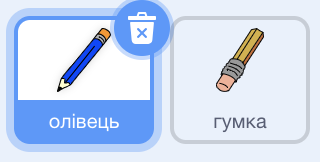

## Створи олівець

Почнімо зі створення олівця, яким ти зможеш малювати на Сцені.

--- task ---

Відкрий початковий проєкт "Набір для малювання" у Скретч.

**Онлайн**: відкрий початковий проєкт на [scratch.mit.edu/projects/396602877](https://scratch.mit.edu/projects/396602877){:target="_blank"}

Якщо у тебе є обліковий запис Скретч, то ти можеш зробити копію проєкту, натиснувши **Ремікс**.

**Офлайн**: відкрий [початковий проєкт](http://rpf.io/p/uk-UA/paint-box-go){:target="_blank"} в офлайн-редакторі.

Якщо тобі треба завантажити та встановити офлайн-редактор Скретч, то ти можеш його знайти на [rpf.io/scratchoff](http://rpf.io/scratchoff){:target="_blank"}

В початковому проєкті ти маєш побачити спрайти олівця та гумки:



--- /task ---

--- task ---

Додай розширення Олівець до свого проєкту.

[[[generic-scratch3-add-pen-extension]]]

--- /task ---

--- task ---

Додай код до спрайту олівця, щоб він `завжди`{:class="block3control"} рухався за вказівником мишки, і щоб таким чином можна було малювати:


```blocks3
when flag clicked
forever
  go to (mouse pointer v)
end
```

--- /task ---

--- task ---

Клацни на прапорець і переміщуй вказівник мишки по Сцені для того, щоб перевірити чи працює твій код.

--- /task ---

Далі зроби, щоб твій олівець малював, тільки `якщо`{:class="block3control"} клавішу мишки натиснуто.

--- task ---

Додай цей код до свого олівця:


```blocks3
when flag clicked
forever
  go to (mouse pointer v)

+ if <mouse down?> then
  pen down
  else
  pen up
end
```

--- /task ---

--- task ---

Перевір свій код ще раз. Цього разу рухай олівець по Сцені, затиснувши клавішу мишки. Чи можеш ти малювати олівцем?


--- /task ---

--- collapse ---
---
title: Олівець малює не кінчиком?
---
Якщо здається, що лінія, яку малює твій олівець, виходить з його середини, тобі треба буде змінити спрайт олівця так, щоб кінчик був у центрі.

Клацни на спрайт олівця і перейди на вкладку **Образи**.

Перемісти образ так, щоб кінчик олівця був **просто над** центром.


Тепер рухай олівець по Сцені і помалюй. Зараз олівець має малювати лінію своїм кінчиком.

--- /collapse ---