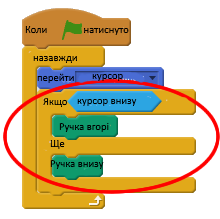
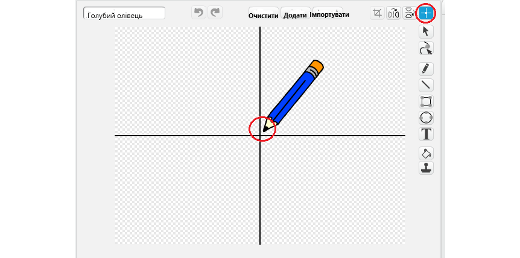

## Створюємо олівець

Почнемо з того, що створимо олівець, який можна використати, щоб намалювати сцену.

+ Відкрийте проект "Scratch" "Paintbox" в Інтернеті на  jumpto.cc/paint-go </ 0> (: target = "_ blank") або завантажте з  http://jumpto.cc/paint-get </ 1> {: target = "_ blank"}, а потім відкрийте його, якщо ви користуєтесь редактором в режимі офлайн.</li> </ul> 
    
    Ви побачите олівець і гумку:
    
    
    
    + Додайте код олівця, щоб при натисканні миші ви могли малювати `назавжди`{:class="blockcontrol"}:
    
    ```blocks
        коли натиснуто прапорець
         назавжди
           перейти до [курсор миші v]
         кінець
    ```
    
    + Натисніть на прапорець, а потім перемістіть курсор миші на сцену, щоб перевірити, чи працює код.
    
    Наступний крок, давайте зробимо так,щоб наш олівець малював `if`{:class="blockcontrol"}, при натисканні мишки.
    
    + Додайте цей код до вашого олівця:
    
    
    
    + Перевірте свій код ще раз. На цей раз, перемістіть олівець навколо сцени і утримуйте кнопку миші. Чи можете ви малювати олівцем?
    
    
    
    ## \--- collapse \---
    
    ## заголовок: Якщо у вас виникли проблеми...
    
    Якщо ви помітили, що олівець малює лінію з середини, а не кінчика, вам доведеться змінити центр.
    
    
    
    Перетин олівця слід розмістити ** трохи нижче ** кінчика олівця, але не на самому кінці.
    
    Зміни в центрі спрайта будуть не збережені, доки не натискатиметься інша вкладка, тому натисніть інший обзор або у вкладці "Скрипти", щоб завершити зміни.
    
    \---collapse\---