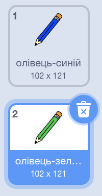

## Кольорові олівці

Тепер ти додаси різнокольорові олівці до свого проєкту і дозволиш користувачеві вибирати між ними.

\--- task \---

Перейменуй образ `олівець` на `олівець-синій`


\--- /task \---

\--- task \---

Клацни правою кнопкою мишки на образ олівця "олівець-синій" і продублюй його.


\--- /task \---

\--- task \---

Назви новий образ "олівець-зелений" і зафарбуй олівець в зелений колір.



\--- /task \---

\--- task \---

Намалюй два нових спрайти: один синій квадрат і один зелений. Вони будуть потрібні для вибору між синім та зеленим олівцями.


\--- /task \---

\--- task \---

Перейменуй нові спрайти так, щоб вони називалися "синій" і "зелений"

[[[generic-scratch3-rename-sprite]]]

\--- /task \---

\--- task \---

Додай код до спрайта "зелений", щоб коли на нього натискають, він `оповіщував`{:class="block3events"} повідомленням "зелений".


```blocks3
when this sprite clicked
broadcast (green v)
```

[[[generic-scratch3-broadcast-message]]]

\--- /task \---

Олівець має чекати на повідомлення "зелений" і змінювати свій образ та колір у відповідь.

\--- task \---

Перемкнися на свій спрайт олівця. Додай код, щоб коли цей спрайт отримував `повідомлення`{:class="block3events"} "зелений", він перемикався на образ зеленого олівця і змінював колір малювання на зелений.


```blocks3
when I receive [green v]
switch costume to (pencil-green v)
set pen color to [#00CC44]
```

Щоб зелений став кольором малювання, клацни на зафарбований квадрат в блоці `надати олівцю колір`{:class="block3extensions"}, далі клацни піпетку, а потім — на зелений квадратний спрайт.

\--- /task \---

Then to a similar thing so that you can switch the pencil colour to blue.

\--- task \---

Click on the blue square sprite and add this code:


```blocks3
when this sprite clicked
broadcast (blue v)
```

Then click on the pencil sprite and add this code:


```blocks3
when I receive [blue v]
switch costume to (pencil-blue v)
set pen color to [#0000ff]
```

\--- /task \---

\--- task \---

Finally, add this code to tell the pencil sprite which colour to start with, and to make sure that the screen is clear when your program starts.


```blocks3
when flag clicked
+erase all
+switch costume to (pencil-blue v)
+set pen color to [#0035FF]
forever
  go to (mouse pointer v)
if <mouse down?> then
  pen down
  else
  pen up
end
```

\--- /task \---

If you prefer, you can start with a different colour pencil.

\--- task \---

Test your code. Can you switch between the blue and green pencil colours by clicking on the blue or green square sprites?


\--- /task \---