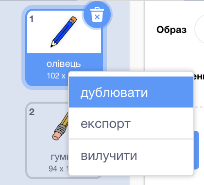
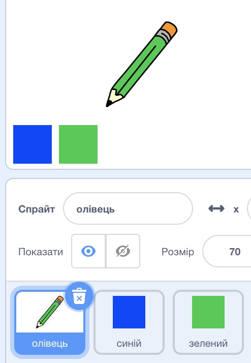

## Кольорові олівці

Давайте додамо до вашого проекту різні кольорові олівці та дозволимо користувачеві обирати палітру.

+ Натисніть на свій олівець "Образи" та скопіюйте "олівець-синій".



+ Перейменуйте ваш новий образ «зелений олівець» і замалюйте олівцем такого самого кольору.


[[[generic-scratch-rename-sprite]]]

+ Намалюйте два нових олівця- один блакитний квадрат і один зелений. Ви використовуватимете їх для вибору синього або зеленого олівця.



+ Перейменуйте свої олівця так, щоб оди називався "голубий", а інший "зелений",

+ Додайте код до "зелений олівець" зправа так, щоб, коли його натиснули, він передав` перейшов на` (: class = "blockevents") повідомлення "зелений" до олівця,таким чином, змінюючи образ та колір олівця.


[[[generic-scratch-broadcast-message]]]

+ Переключіться на ваш олівець. Додайте код, таким чином,щоб, коли цей олівець перейшов на `broadcast`{:class="blockevents"}, він змінював колір олівця на зелений.


Щоб намалювати олівець зеленим кольором, натисніть кольоровий квадрат у наборі кольорів </code>{:class="blockpen"} і нажміть на зелений спрайт, щоб вибрати цей колір для олівця.

+ Тепер ви можете робити таке ж саме і для піктограми блакитного олівця: додати цей код до синій квадратних спрайтів:

```blocks
коли цей спрайт натиснуто
перехід [синій v]
```

...додайте цей код до вашого олівця:

```blocks
коли я отримую [голубий v]
Перехід обзору на [голубий олівець]
встановити ручку кольору [# 0000ff]
```

+ Накінець, додайте цей код, щоб повідомити про те, з якого кольору слід розпочинати, і переконайтеся, що екран чистий.


Ми вирішили розпочати з синього кольору, але, якщо захочете, ви можете почати з іншого кольору.

+ Перевірте ваш проект. Ви можете переключитися між синім та зеленим ручками, натискаючи сині або зелені квадратні спрайти.

