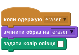

## Кольорові олівці

Давайте додамо до вашого проекту різні кольорові олівці та дозволимо користувачеві обирати палітру.

+ Натисніть на свій олівець "Образи" та скопіюйте "олівець-синій".


+ Rename your new costume 'pencil-green', and colour the pencil green.


[[[generic-scratch-rename-sprite]]]

+ Draw two new sprites - one blue square and one green square. You will use these to select the blue or green pencil.


+ Rename your sprites so that they are called 'blue' and 'green'

+ Add some code to the 'green' sprite so that when it is clicked, it will `broadcast`{:class="blockevents"} the message "green" to the pencil sprite, telling it to change its costume and pencil colour.


[[[generic-scratch-broadcast-message]]]

+ Switch to your pencil sprite. Add some code so that when this sprite receives the `broadcast`{:class="blockevents"} green, it should switch to the green pencil costume and change the pen colour to green.



To set the pencil to colour to green, click the coloured box in the `set pen color`{:class="blockpen"} block, and click on the green sprite to choose the same colour green as your pencil colour.

+ You can now do the same for the blue pencil icon: add this code to the blue square sprite:

```blocks
when this sprite clicked
broadcast [blue v]
```

...and add this code to the pencil sprite:

```blocks
when I receive [blue v]
switch costume to [pencil-blue v]
set pen color to [#0000ff]
```

+ Finally, add this code to tell the pencil sprite which colour to start with, and make sure that the screen is clear.


Ми вирішили розпочати з синього кольору, але, якщо захочете, ви можете почати з іншого кольору.

+ Перевірте ваш проект. Ви можете переключитися між синім та зеленим ручками, натискаючи сині або зелені квадратні спрайти.

