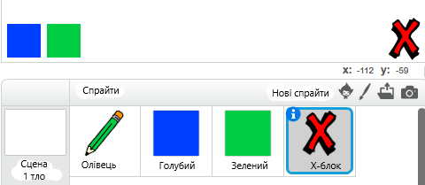
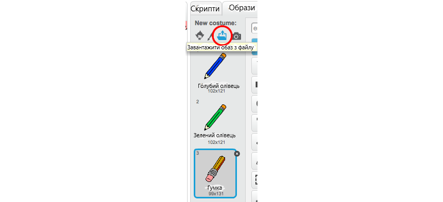

## Виправ хиби

Інколи трапляються хиби, тому додай кнопки очистки та гумки.

\--- task \---

Додай спрайт "Block-X" із розділу літер в бібліотеці. Зафарбуй образ спрайта в червоний колір і зроби його трохи меншим. Цей спрайт буде кнопкою очистки.

[[[generic-scratch3-sprite-from-library]]]



\--- /task \---

\--- task \---

Додай код до спрайта "Block-X", щоб очищувати Сцену, коли на нього клацають.


```blocks3
when this sprite clicked
erase all
```

\--- /task \---

Тобі не треба використовувати `оповіщення`{:class="block3events"} для очищення сцени, тому що блока `очистити все`{:class="block3extensions"} достатньо.

Ти помітив (-ла), що спрайт олівця містить образ гумки?



Твій проєкт також містить окремий спрайт гумки.

\--- task \---

Вибери спрайт гумки і клацни **показати** (іконка із оком). Ось як тепер має виглядати твоя Сцена:


\--- /task \---

\--- task \---

Додай код до спрайту гумки, щоб здійснювати `оповіщення "гумка"`{:class="block3events"}, коли на нього клацають.


```blocks3
when this sprite clicked
broadcast (eraser v)
```

\--- /task \---

Коли спрайт олівця отримує повідомлення "гумка", він має змінювати свій образ на гумку і перемикати колір малювання на білий, який є кольором Сцени!

\--- task \---

Додай код для програмування гумки.

\--- hints \--- \--- hint \---

Додай код до спрайта олівця: `Коли я отримую`{:class="block3events"} повідомлення `"гумка"`{:class="block3events"} `Змінити образ на гумку`{:class="block3looks"} `Надати олівцю колір`{:class="block3extensions"} білий

\--- /hint \--- \--- hint \---

Ось усі блоки, які тобі знадобляться:

```blocks3
set pen color to [#FFFFFF]
when I receive [eraser v]

switch costume to (eraser v)
```

\--- /hint \--- \--- hint \---

Ось як має виглядати твій код:


```blocks3
when I receive [eraser v]
switch costume to (eraser v)
set pen color to [#FFFFFF]
```

\--- /hint \--- \--- /hints \--- \--- /task \---

\--- task \---

Протестуй свій проєкт, щоб перевірити, чи ти можеш очищувати Сцену і стирати лінії, зроблені олівцем.


\--- /task \---

Із олівцем є ще одна проблема: ти можеш малювати де завгодно на Сцені, в тому числі біля кнопок очищення та гумки!


\--- task \---

Для того, щоб це виправити, зміни код так, щоб олівець опускався, тільки якщо клавіша мишки натиснута, **і** координата `y` вказівника мишки більша за `-120`:


```blocks3
when flag clicked
erase all
switch costume to (pencil-blue v)
set pen color to [#0035FF]
forever
  go to (mouse pointer v)
+if <<mouse down?> and <(mouse y) > [-120]>> then 
  pen down
  else
  pen up
end
```

\--- /task \---

\--- task \---

Перевір свій проєкт. Тепер ти не зможеш малювати біля кнопок.


\--- /task \---