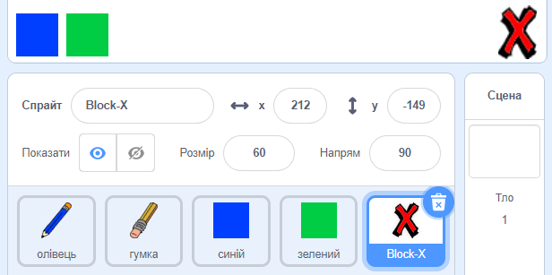

## Помилки

Іноді помилки трапляються, так що давайте додамо кнопку 'очистити' та гумку.

+ Додайте 'X-block' спрайт - ви зможете знайти його в бібліотеці, в розділі букв. Змініть колір костюма на червоний. This will become the 'clear' button.



+ Add code to this sprite to clear the stage when it's clicked.


Notice that you don't need to send a message to clear the stage, you can just use the clear block from this sprite.

You have probably noticed that your pencil sprite includes an eraser costume:


+ Your project also includes a separate eraser sprite. Клацніть правою кнопкою миші на цьому спрайті і виберіть 'Показати'. Ось як повинна виглядати ваша сцена:


+ Add code to the eraser sprite, to tell the pencil to switch to an eraser when the sprite is clicked.


When the pencil receives the "eraser" message, you can switch the pencil costume to the eraser, and switch the pencil colour to white - the same colour as the stage!

+ Додайте деякі коду для створення гумки

\--- hints \--- \--- hint \--- Add some code to the pencil sprite: **When I receive** the **eraser** message **Switch to costume** eraser **Set pen color** to white \--- /hint \--- \--- hint \--- Here is how the code inside the pencil sprite should look:

```blocks
when I receive [eraser v]
switch costume to [eraser v]
set pen color to [#FFFFFF]
```

\--- /hint \--- \--- /hints \---

+ Перевірте свій проект, щоб побачити, чи можна очистити та стерти платформу.


There's one more problem with the pencil - you can draw anywhere on the stage, including near the selector icons!


To fix this, tell the pencil only to draw if the mouse is clicked *and* if the y-position of the mouse is greater than -120:


+ Test your project; you now shouldn't be able to draw near the selector blocks.

