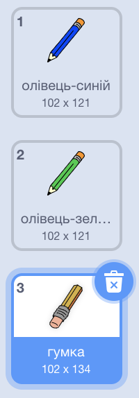
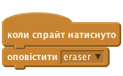

## Помилки

Іноді помилки трапляються, так що давайте додамо кнопку 'очистити' та гумку.

+ Додайте 'X-block' спрайт - ви зможете знайти його в бібліотеці, в розділі букв. Змініть колір костюма на червоний. Це буде кнопка «Очистити».


+ Додайте код до цього спрайта, щоб очистити сцену, коли вона натиснута.


Зверніть увагу, що вам не потрібно надсилати повідомлення, щоб очистити сцену, ви можете просто використовувати чіткий блок із цього спрайту.

Мабуть, ви помітили, що олівець спрайт включає в себе гумку-костюм:



+ Ваш проект також включає в себе окрему гумку-спрайт. Клацніть правою кнопкою миші на цьому спрайті і виберіть 'Показати'. Ось як повинна виглядати ваша сцена:


+ Додайте код до гумки, щоб вказати, як олівець переключатиметься на неї, під час натискання спрайту.



Коли олівець отримує повідомлення від «гумка», ви можете переключити обзор на гумку і змінити колір олівця в білий - такий самий колір, що і на сцені!

+ Додайте деякі коду для створення гумки

\--- hints \--- \--- hint \--- Додайте код до олівця: ** Коли я отримую** гумка ** повідомлення ** ** Перемикання на обзор ** <0> Встановити колір ручки ** білий \--- hints \--- \--- hint \--- Ось як повинен виглядати код олівця:</p> 

```blocks
коли я отримую [ гумка]
перехід тла на [гумка v]
встановити колір ручки [#FFFFFF]
```

\--- /hint \--- \--- /hints \---

+ Перевірте свій проект, щоб побачити, чи можна очистити та стерти платформу.


Є ще одна проблема з олівцем - ви можете малювати в будь-якому місці на сцені, в тому числі біля піктограми селектора!


To fix this, tell the pencil only to draw if the mouse is clicked *and* if the y-position of the mouse is greater than -120:


+ Test your project; you now shouldn't be able to draw near the selector blocks.

