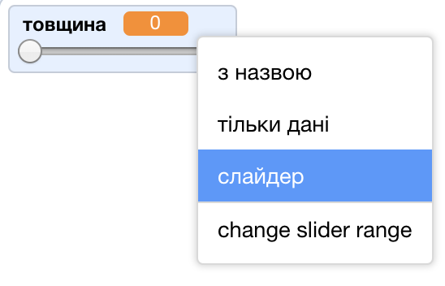
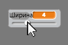

## Зміни товщину олівця

Далі ти напишеш код, щоб користувач твоєї програми міг малювати з використанням ліній різної товщини.

\--- task \---

По-перше, додай нову змінну з іменем `товщина`{:class="block3variables"}.

[[[generic-scratch3-add-variable]]]

\--- /task \---

\--- task \---

Додай цей рядок **всередині** циклу `завжди`{:class="block3control"} у коді спрайта олівця:

```blocks3
when flag clicked
erase all
switch costume to (pencil-blue v)
set pen color to [#0035FF]
forever
go to (mouse pointer v)
+set pen size to (width :: variables)
if <<mouse down?> and <(mouse y) > [-120]>> then 
  pen down
  else
  pen up
end
```

\--- /task \---

Тепер товщина олівця постійно встановлюється рівною значенню змінної `товщина`{:class="block3variables"}.

\--- task \---

Клацни правою кнопкою мишки на відображення змінної `товщина`{:class="block3variables"} на Сцені та вибери **слайдер**.



\--- /task \---

Тепер ти можеш перетягувати повзунок, що відображається під змінною, щоб встановлювати її значення.



\--- task \---

Test your project and see if you can add code to adjust the pen width.


\--- /task \---