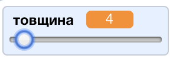

## Зміна ширини олівця

Надаємо доступ користувачеві малювати за допомогою діапазону різних розмірів олівця.

+ Спершу, створіть список, який називається ` width` {: class = "blockvariable"}.

[[[generic-scratch-add-variable]]]

+ Додайте цей рядок *inside* the `forever`{:class="blockcontrol"} цикл коду олівця:

```blocks
    встановити розмір ручки до (ширина)
```

Ширина олівця буде тепер неодноразово налаштована на значення змінної "ширини".

+ Клікніть правою кнопкою миші на змінному екрані на платформі та клацніть на "повзунок".


Тепер ви можете перетягувати слайдер нижче змінної, щоб змінити його значення.



+ Перевірте свій проект та подивіться, чи можна змінити ширину олівця.


Якщо ви забажаєте, ви можете встановити мінімальне та максимальне значення ширини, яке дозволено. Для цього клацніть правою кнопкою миші на змінну і натисніть "встановити слайдер міні та макс". Set the minimum and maximum values of your variable to something more sensible, like 1 and 20.


Продовжуйте протестувати вашу змінну "ширина", поки не досягнете бажаного результату.