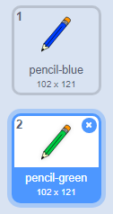

## رنگ پنسل

آئیے مختلف رنگ کے پنسل آپ کے منصوبے میں شامل کریں، اور صارف کو ان کے درمیان منتخب کرنے کی اجازت دیں.

+ اپنے پنسل سپرے پر کلک کریں، 'ملبوسات' پر کلک کریں اور اپنے 'پنسل نیلے رنگ کا لباس' نقل کریں.


+ اپنی نئی کپڑے 'پنسل سبز' کا نام تبدیل کریں، اور پنسل سبز رنگیں.



[[[generic-scratch-rename-sprite]]]

+ ایک نیا نیلے رنگ اور ایک سبز مربع کے دو نئے چادریں ڈرا. آپ ان نیلے یا سبز پنسل کو منتخب کرنے کے لئے استعمال کریں گے.


+ اپنے اسپریوں کا نام تبدیل کریں تاکہ انہیں 'نیلے' اور 'سبز' کہا جائے.

+ 'سبز' سپرائٹ کے لئے کچھ کوڈ شامل کریں تاکہ اسے کلک کیا جاتا ہے جب، یہ ہو گا `نشر`{: کلاس = "blockevents"} پنسل سپرائٹ کو پیغام "گرین"، یہ بتا رہی اس کے کاسٹیوم اور پنسل رنگ تبدیل کرنے کے لئے.


[[[generic-scratch-broadcast-message]]]

+ اپنے پینسل سپرے میں سوئچ کریں. کچھ کوڈ شامل کریں تاکہ جب اس سپرے `براڈکاسٹر`{: کلاس = "بلاؤفینٹ"} سبز ہوجائے تو اسے سبز پینسل کا لباس پہننے اور سبز رنگ میں رنگ تبدیل کرنا چاہئے.


سبز رنگ کو پنسل ترتیب دینے کیلئے، میں رنگ کے خانے پر کلک کریں `سیٹ قلم رنگ`{: کلاس = "blockpen"} بلاک، اور آپ پنسل رنگ کے طور پر ایک ہی رنگ سبز منتخب کرنے کے لئے سبز سپرائٹ پر کلک کریں.

+ اب آپ نیلے رنگ پنسل آئیکن کے لئے ایسا کر سکتے ہیں: اس کوڈ کو نیلے رنگ کے اسکرین پر شامل کریں:

```blocks
جب اس سپرے براڈکاسٹ پر کلک کیا [نیلا وی]
```

... اور اس کوڈ کو پنسل سپرے میں شامل کریں:

```blocks
جب مجھے [نیلے رنگ] سوئچ کا لباس [پنسل نیلے رنگ] پر قلم رنگ مقرر کیا جاتا ہے [# 0000ff]
```

+ آخر میں، اس کوڈ کو شامل کریں کہ پنسل سپرے کو کونسا رنگ شروع کرنا ہے، اور اس بات کو یقینی بنائیں کہ سکرین واضح ہے.


ہم نے نیلے رنگ سے شروع کرنے کا انتخاب کیا لیکن اگر آپ چاہیں تو، آپ مختلف رنگ پنسل کے ساتھ شروع کر سکتے ہیں.

+ اپنے منصوبے کو آزمائیں. کیا آپ نیلے اور سبز رنگ کے سپرے پر کلک کرکے نیلے اور سبز قلم کے درمیان سوئچ کر سکتے ہیں؟

