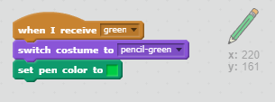

## Bút chì màu

Hãy thêm bút chì màu khác nhau vào dự án của bạn và cho phép người dùng lựa chọn giữa chúng.

+ Nhấp vào bút chì của bạn, nhấp vào 'Trang phục' và nhân đôi trang phục 'bút chì màu xanh' của bạn.


+ Đổi tên trang phục mới của bạn 'bút chì màu xanh' và tô màu bút chì màu xanh lục.


[[[generic-scratch-rename-sprite]]]

+ Vẽ hai sprites mới - một ô vuông màu xanh và một ô vuông màu xanh lục. Bạn sẽ sử dụng chúng để chọn bút chì màu xanh dương hoặc xanh lục.


+ Đổi tên các sprites của bạn để chúng được gọi là 'blue' và 'green'

+ Thêm một số mã vào ký tự 'xanh' để khi nó được nhấp, nó sẽ `phát`{: class = "blockevents"} thông báo "xanh" thành bút chì, bảo nó thay đổi màu trang phục và bút chì.


[[[generic-scratch-broadcast-message]]]

+ Chuyển sang bút chì của bạn. Thêm một số mã để khi sprite này nhận được `phát sóng`{: class = "blockevents"} màu xanh lá cây, nó sẽ chuyển sang trang phục bút chì màu xanh lá cây và thay đổi màu bút thành màu xanh lục.



Để đặt bút chì thành màu xanh lá cây, hãy nhấp vào hộp màu trong khối màu `set`{: class = "blockpen"}, và nhấp vào màu xanh lá cây để chọn màu xanh lá cây giống như màu bút chì của bạn.

+ Bây giờ bạn có thể làm tương tự cho biểu tượng bút chì màu xanh: thêm mã này vào hình vuông màu xanh:

```blocks
khi sprite này được phát sóng [blue v]
```

... và thêm mã này vào bút chì sprite:

```blocks
khi tôi nhận được trang phục chuyển đổi [blue v] thành [pencil-blue v] đặt bút màu thành [# 0000ff]
```

+ Cuối cùng, thêm mã này để nói cho bút chì có màu bắt đầu bằng, và đảm bảo rằng màn hình rõ ràng.


Chúng tôi đã chọn để bắt đầu với màu xanh nhưng nếu bạn thích, bạn có thể bắt đầu với một bút chì màu khác nhau.

+ Thử nghiệm dự án của bạn. Bạn có thể chuyển đổi giữa bút màu xanh dương và xanh lá cây bằng cách nhấp vào hình vuông màu xanh hoặc hình vuông màu xanh lá cây không?

