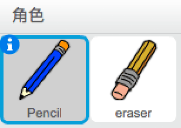
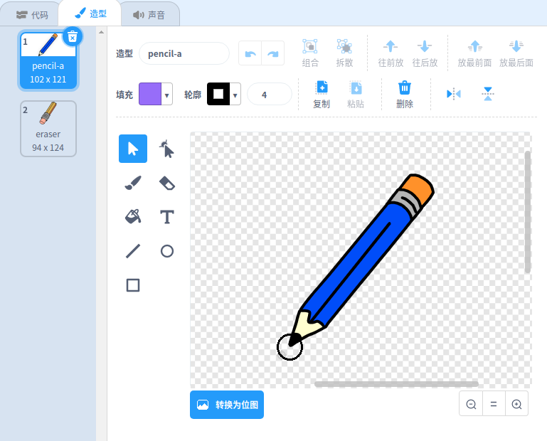

## 制作铅笔

首先制作一支可以用来在舞台上画画的铅笔。

\--- 任务 \--- 打开'Paint box'Scratch starter项目。

**在线**：在 [rpf.io/paint-box-on](http://rpf.io/paint-box-on){：target =“_ blank”}打开启动项目

如果您有Scratch帐户，可以单击 **Remix**制作副本。

**离线**：在离线编辑器中打开 [启动项目](http://rpf.io/p/en/paint-box-go){：target =“_ blank”}。

如果您需要下载并安装Scratch离线编辑器，可以在 [rpf.io/scratchoff](http://rpf.io/scratchoff){：target =“_ blank”}找到它。

在启动项目中，你应该看到铅笔和橡皮擦精灵：

 \--- /任务\---

\--- /任务\---

将Pen扩展添加到项目中。

[[[generic-scratch3-add-pen-extension]]]

\--- /任务\---

\--- /任务\---

添加一些代码到铅笔精灵，使精灵跟随鼠标指针 `永远`{：class =“block3control”}，以便您可以绘制：


```blocks3
when flag clicked
forever
  go to (mouse pointer v)
end
```

\--- /任务\---

\--- 任务 \--- 单击标志，然后在舞台上移动鼠标指针以测试代码是否有效。 \--- /任务\---

接下来，如果</code>{{class =“block3control”}单击鼠标按钮，则使您的铅笔仅绘制 `。</p>

<p>--- 任务 ---
将此代码添加到您的铅笔精灵：</p>

<p></p>

<pre><code class="blocks3">when flag clicked
forever
  go to (mouse pointer v)

+ if <mouse down?> then
  pen down
  else
  pen up
end
`</pre> 

\--- /任务\---

\--- 任务 \--- 再次测试您的代码。 这一次，在舞台上移动铅笔并按住鼠标按钮。 你能用铅笔画画吗？

 \--- /任务\---

## \--- 折叠 \---

## 标题：你的铅笔不是从它的尖端画出来的吗？

如果铅笔绘制的线看起来像铅笔的中间，你需要更改铅笔精灵，这样尖端就是精灵的中心。

单击铅笔精灵，然后单击 **Costumes** 选项卡。

移动服装，使铅笔的尖端在中心的</strong> 上方 **。</p> 



现在在舞台上移动铅笔并画画。 铅笔现在应该从它的尖端画一条线。

\--- /折叠 \---