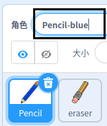
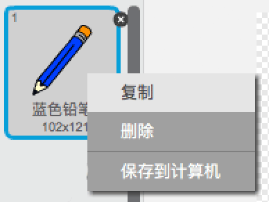
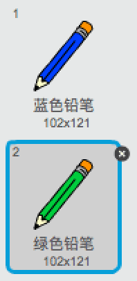

## 彩色铅笔

现在，您将为项目添加不同颜色的铅笔，并允许用户在它们之间进行选择。

\--- task \--- 将 `铅笔` 精灵重命名为 `铅笔蓝`

 \--- /task \---

\--- task \--- 右键点击铅笔精灵，并复制'铅笔蓝'服装。

 \--- /task \---

\--- task \--- 将新服装命名为“铅笔 - 绿色”，并将铅笔绿色。



\--- /task \---

\--- task \--- 绘制两个新的精灵：一个蓝色正方形和一个绿色正方形。 这些用于在蓝色和绿色铅笔之间进行选择。

 \--- /task \---

\--- task \--- 重命名新精灵，使它们被称为'蓝色'和'绿色'

[[[generic-scratch3-rename-sprite]]]

\--- /task \---

\--- task \--- 一些代码添加到“绿色”精灵，以便被点击此sprite时, `广播`{：class="block3events"}消息“绿色”。


```blocks3
when this sprite clicked
broadcast (green v)
```

[[[generic-scratch3-broadcast-message]]] \--- /task \---

铅笔精灵应该听取“绿色”信息，并改变其服装和铅笔颜色作为回应。

\--- task \--- 切换到你的铅笔精灵。 添加一些代码，以便当此精灵收到 `绿色`{：class =“block3events”}广播时，它会切换到绿色铅笔服装并将笔颜色更改为绿色。


```blocks3
when I receive [green v]
switch costume to (pencil-green v)
set pen color to [#00CC44]
```

要将铅笔颜色设置为绿色，请单击 `set pen color`{class="block3extensions"}块中的彩色方块，然后单击绿色方形精灵。 \--- /task \---

然后到类似的事情，以便您可以将铅笔颜色切换为蓝色。

\--- task \--- 点击蓝色方形精灵并添加以下代码：


```blocks3
when this sprite clicked
broadcast (blue v)
```

然后单击铅笔精灵并添加以下代码： 

```blocks3
when I receive [blue v]
switch costume to (pencil-blue v)
set pen color to [#0000ff]
```

\--- /task \---

\--- task \--- 最后，添加此代码告诉铅笔精灵开始使用哪种颜色，并确保程序启动时屏幕干净。


```blocks3
when flag clicked
+erase all
+switch costume to (pencil-blue v)
+set pen color to [#0035FF]
forever
  go to (mouse pointer v)
if <mouse down?> then
  pen down
  else
  pen up
end
```

\--- /task \---

如果您愿意，可以使用其他彩色铅笔。

\--- task \--- 测试你的代码。 你可以点击蓝色或绿色方形精灵在蓝色和绿色铅笔颜色之间切换吗？

 \--- /task \---