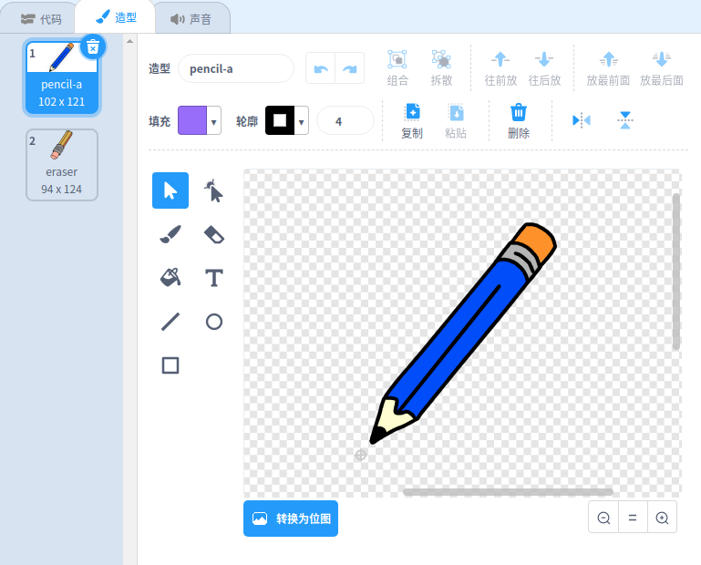

## 创建铅笔

让我们从创建一支能在舞台上绘画的铅笔开始。

+ 在线打开“颜色盒”工程[jumpto.cc/paint-go](http://jumpto.cc/paint-go){:target="_blank"} 或者从 <http://jumpto.cc/paint-get>{:target="_blank"}下载离线项目用离线编辑器打开。

你将会看到铅笔和橡皮：


+ 向铅笔中添加代码让它`永远`{:class="blockcontrol"} 跟随鼠标移动，这样你就可以画画了：

```blocks
    when flag clicked
    forever
      go to [mouse pointer v]
    end
```

+ Click the flag and then move the mouse around the stage to test whether the code works.

Next, let's make your pencil only draw `if`{:class="blockcontrol"} the mouse has been clicked.

+ Add this code to your pencil sprite:


+ Test your code again. This time, move the pencil around the stage and hold down the mouse button. Can you draw with your pencil?


## \--- collapse \---

## title: If you're having problems...

If your pencil seems to be drawing the line from the middle of the pencil rather than the tip, you will need to change your costume center.



The crosshair for the pencil must be placed **just below** the tip of the pencil, not on the tip of the pencil.

A changes in a sprite's 'costume center' isn't registered until another tab is clicked, so click on another costume, or on the 'Scripts' tab to finalise your changes to the costume center.

\--- /collapse \---