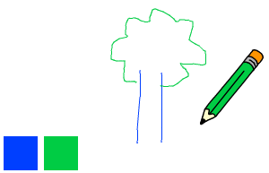

## 彩色铅笔

让我们向项目中国添加其他颜色的铅笔，让用户可以选择不用颜色的铅笔。

+ 点击铅笔角色，点击“造型”然后复制“蓝色铅笔”造型。


+ 将新造型命名为“绿色铅笔”，并将它变成绿色。


[[[generic-scratch-rename-sprite]]]

+ 绘制2个新角色 -- 一个蓝色方块，一个绿色方块。 你将用这2个方块来选择蓝色或绿色铅笔。


+ 将角色重命名为“蓝色”和“绿色”

+ Add some code to the 'green' sprite so that when it is clicked, it will `broadcast`{:class="blockevents"} the message "green" to the pencil sprite, telling it to change its costume and pencil colour.


[[[generic-scratch-broadcast-message]]]

+ Switch to your pencil sprite. Add some code so that when this sprite receives the `broadcast`{:class="blockevents"} green, it should switch to the green pencil costume and change the pen colour to green.


To set the pencil to colour to green, click the coloured box in the `set pen color`{:class="blockpen"} block, and click on the green sprite to choose the same colour green as your pencil colour.

+ You can now do the same for the blue pencil icon: add this code to the blue square sprite:

```blocks
when this sprite clicked
broadcast [blue v]
```

...and add this code to the pencil sprite:

```blocks
when I receive [blue v]
switch costume to [pencil-blue v]
set pen color to [#0000ff]
```

+ Finally, add this code to tell the pencil sprite which colour to start with, and make sure that the screen is clear.


We chose to start with blue but if you prefer, you can start with a different colour pencil.

+ Test out your project. Can you switch between blue and green pens by clicking on the blue or green square sprites?

