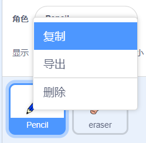

## 彩色铅笔

让我们向项目中国添加其他颜色的铅笔，让用户可以选择不用颜色的铅笔。

+ 点击铅笔角色，点击“造型”然后复制“蓝色铅笔”造型。



+ 将新造型命名为“绿色铅笔”，并将它变成绿色。


[[[generic-scratch-rename-sprite]]]

+ 绘制2个新角色 -- 一个蓝色方块，一个绿色方块。 你将用这2个方块来选择蓝色或绿色铅笔。


+ 将角色重命名为“蓝色”和“绿色”

+ 向“绿色”角色添加代码，让它被点击时`广播`{:class="blockevents"}消息“变绿色”给铅笔角色，告诉铅笔改变造型和颜色。


[[[generic-scratch-broadcast-message]]]

+ 切换到铅笔角色。 添加代码让它在接收到`广播`{:class="blockevents"}变绿色时，切换到绿色铅笔造型并改变画笔的颜色为绿色。


要将铅笔的颜色设为绿色，点击`将画笔颜色设置为`{:class="blockpen"} 代码块中的颜色块，然后点击绿色方块角色，为画笔选择与绿色方块相同的绿色。

+ 现在你可以对蓝色图标做相同的操作：添加如下代码到蓝色方块角色：

```blocks
当角色被点击
广播消息 [变蓝色 v]
```

...并将如下代码加入铅笔角色：

```blocks
当收到消息 [变蓝色 v]
造型换成 [蓝色铅笔 v]
笔迹颜色设为 [#0000ff]
```

+ 最后，添加如下代码告诉铅笔初始用哪个颜色，并且确保开始时舞台是干净的。


我们默认起始用蓝色，如果你愿意，你可以选择不同颜色的铅笔。

+ 测试你的项目。 你可以通过点击蓝色或绿色方块来切换蓝色和绿色铅笔吗？

