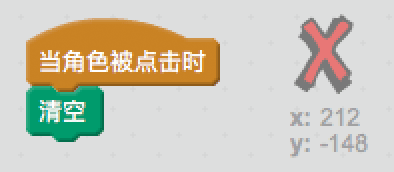
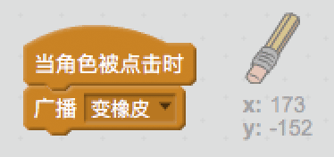
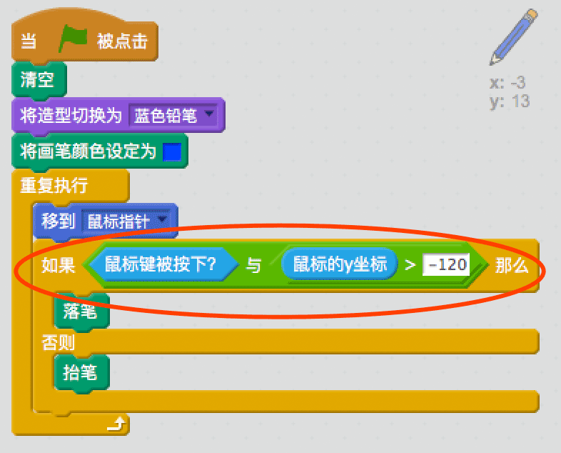

## 孰能无过

有时我们会画错，所以让我们加入“清除”按钮和橡皮。

+ 添加‘X-block'角色 -- 你可以在角色库的字母分类中找到它。 将造型改为红色。 这样就变为了“清除”按钮。


+ 向清除按钮中添加代码，让它被点击时清空舞台上的内容。



注意你不需要通过发送消息来清空舞台，你可以直接在角色中使用清空代码块。

你可能已经发现铅笔角色包含来一个橡皮造型：


+ 项目中还包含一个单独的橡皮角色。 右键点击这个角色并选择“显示”。 你的舞台应该跟下图一样：


+ 向橡皮角色中添加代码，当橡皮被点击时告诉铅笔切换到橡皮。



当铅笔接收到“变橡皮”消息时，你可以将铅笔造型切换为橡皮，并将画笔颜色设为白色 -- 与舞台颜色一致！

+ 为橡皮添加如下代码

\--- hints \--- \--- hint \--- 为铅笔角色添加如下代码： **当收到** **变橡皮**消息时 **造型换成**橡皮 **笔迹颜色设为**白色 \--- /hint \--- \--- hint \--- 下面是铅笔角色内的代码：

```blocks
当收到消息 [变橡皮 v]
造型换成 [橡皮 v]
笔迹颜色设为 [#FFFFFF]
```

\--- /hint \--- \--- /hints \---

+ 测试你的项目，看你是否能够清空和擦除舞台上的内容。


你的铅笔还有一点小问题 -- 你可以在舞台的任意地方绘制，包括选择图标区域！


要修复这个问题，只需要告诉铅笔只能在鼠标按下*并且*y坐标大于-120时才绘图：



+ 测试你的项目；现在你应该不能绘制到选择图标区域了。

