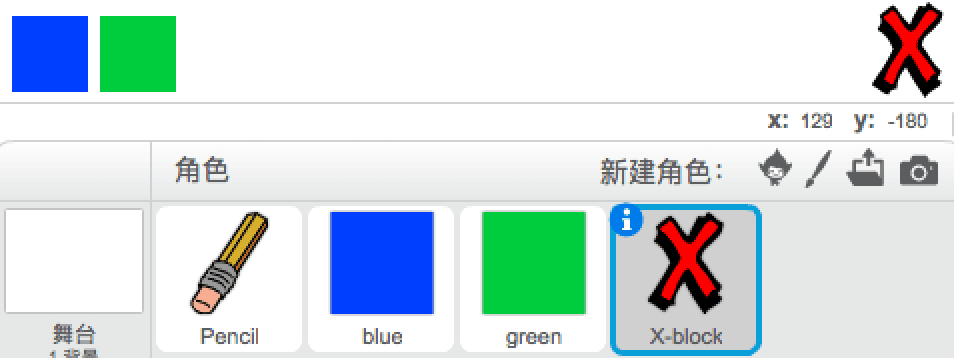
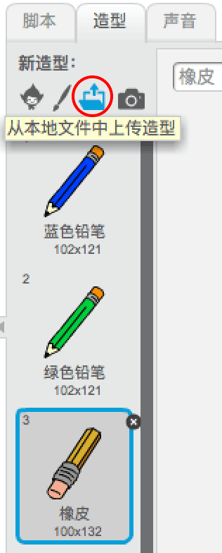
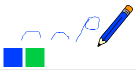

## 更改笔尖宽度

有时会发生错误，因此请添加“清除”按钮和橡皮擦按钮。

\--- 任务 \--- 从库的字母部分添加'X-block'精灵。 将精灵的服装涂成红色并使其略小一些。 这个精灵是'清除'按钮。

[[[generic-scratch3-sprite-from-library]]]

 \--- /任务\---

\--- 任务 \----- 添加代码到 'X-block' 图形，以便在点击时清除该舞台。


```blocks3
when this sprite clicked
erase all
```

\--- /任务\---

您不需要使用 `广播`{：class =“block3events”}来清除舞台，因为 `擦除所有`{：class =“block3extensions”}块执行该作业。

你看到铅笔精灵包括橡皮擦服装吗？



项目中还包含一个单独的橡皮角色。

\--- 任务 \----- 右键点击此擦除器图形，然后点击 **显示**。 以下是您的舞台现在的样子：

 \--- /任务\---

\--- 任务 \--- 当橡皮精灵被点击时，将代码添加到橡皮精灵以发送 `'橡皮擦'广播`{：class =“block3events”}。


```blocks3
when this sprite clicked
broadcast (eraser v)
```

\--- /任务\---

当铅笔精灵收到“橡皮擦”信息时，它应该将其服装切换到橡皮擦并将笔颜色切换为白色，这与舞台颜色相同！

\--- 任务 \--- 添加一些代码来创建橡皮擦。

\---提示\--- \---提示\--- 向铅笔精灵添加一些代码： `当我收到`{：class =“block3events”}时， `橡皮擦`{：class =“block3events”}消息 `切换到服装橡皮擦`{：class =“block3looks”} `将笔颜色`{：class =“block3extensions”}设置为白色 \--- /提示\--- \---提示\--- 以下是您需要的所有块：

```blocks3
set pen color to [#FFFFFF]
when I receive [eraser v]

switch costume to (eraser v)
```

\--- /提示\--- \---提示\--- 这是代码的样子： 

```blocks3
when I receive [eraser v]
switch costume to (eraser v)
set pen color to [#FFFFFF]
```

\--- /提示\--- \--- /提示\--- \--- /任务\---

\--- 任务 \--- 测试你的项目，看看你是否可以清除舞台并擦除铅笔线。

 \--- /任务\---

铅笔还有一个问题：你可以在舞台上的任何地方画画，包括“透明”和橡皮擦按钮附近！


\--- 任务 \--- 要解决此问题，请更改代码，以便在单击鼠标时仅向下笔 **和** 鼠标指针的 `y` 位置大于 `-120`：


```blocks3
when flag clicked
erase all
switch costume to (pencil-blue v)
set pen color to [#0035FF]
forever
  go to (mouse pointer v)
+if <<mouse down?> and <(mouse y) > [-120]>> then 
  pen down
  else
  pen up
end
```

\--- /任务\---

\---任务 \--- 测试你的项目。 你现在不应该在按钮附近画画。

 \--- /任务\---