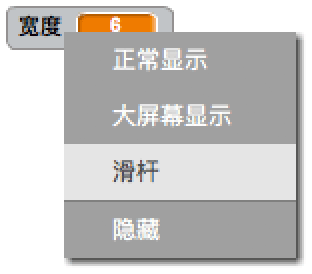

## 更改笔宽

接下来，您将添加代码以允许使用您的程序的人绘制具有不同笔宽的内容。

\--- task \--- 首先，添加一个名为 `width`{：class =“block3variables”}的新变量。

[[[generic-scratch3-add-variable]]] \--- /任务\---

\--- task \--- 将此行 **添加到** `永久的`{：class =“block3control”}循环的铅笔精灵的代码中：

```blocks3
当标记点击时
擦除所有
开关服装（铅笔蓝色v）
设置笔颜色为[＃0035FF]
永远
转到（鼠标指针v）
+设置笔尺寸为（宽度::变量）
如果 <<mouse down?> 和 <（鼠标y） > [-120]>> 然后 
  笔下来
  否则
  笔上升
结束
```

\--- /task \---

笔宽现在重复设置为 `宽度`{：class =“block3variables”}变量的值。

\--- task \--- 右键单击舞台上显示的 `宽`{：class =“block3variables”}变量，然后单击 **滑块**。

 \--- /task \---

您现在可以拖动变量下方可见的滑块来更改变量的值。


\--- task \--- 测试你的项目，看看你是否可以添加代码来调整笔的宽度。

 \--- /task \---