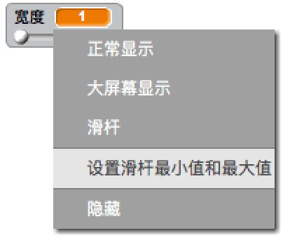

## 改变铅笔宽度

让我们允许用户使用不同粗细的铅笔来绘图。

+ 首先，新建一个名为`宽度`{:class="blockvariable"}的变量。

[[[generic-scratch-add-variable]]]

+ 将这行代码添加到铅笔代码的`重复执行`{:class="blockcontrol"} 循环*内*：

```blocks
    笔迹宽度设为 (宽度)
```

现在铅笔的宽度会不断地被设置为变量“宽度”的值。

+ 右键点击显示在舞台上的变量然后点击“滑杆”。


你可以拉动滑杆改变变量的值。


+ 测试你的项目，看能否改变铅笔宽度。


如果你愿意，你可以设置笔尖“宽度”允许的最大最小值。 要设置最大最小值，右键点击变量并点击“设置滑杆最小值和最大值”。 将最小值和最大值设置得更加合理一些，比如1和20。



反复测试宽度变量直到你满意为止。