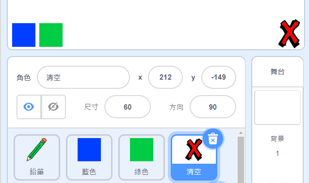
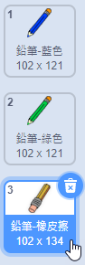

## 清空與擦除

有時候我們會畫錯些東西，有個「清空」和「擦除」的工具會很方便的。

\--- task \---

加入一個有叉叉樣式的角色，你可以用英文字母 X 來代表。 把角色的造型塗成紅色，然後變小一些。 這個角色用來當作「清空」按鈕。

[[[generic-scratch3-sprite-from-library]]]



\--- /task \---

\--- task \---

為清空按鈕編寫程式，在點擊角色時，把舞台上的所有筆跡都清除。


```blocks3
當角色被點擊
筆跡全部清除
```

\--- /task \---

在這裡，你不需要用`廣播`{:class="block3events"}的方式，因為`筆跡全部清除`{:class="block3extensions"}這個程式積木就可以完成這件工作。

你觀察到了嗎？鉛筆角色裡頭，是不是有個橡皮擦的造型。



然後，你的專案也有角色的造型是橡皮擦，名稱叫做「擦除」。

\--- task \---

Click on this eraser sprite and then select **show**.


Here is how your Stage should look now:


\--- /task \---

\--- task \---

Add code to the eraser sprite to send an `'eraser' broadcast`{:class="block3events"} when the eraser sprite is clicked.


```blocks3
當角色被點擊
廣播訊息 (換成橡皮擦 v)
```

\--- /task \---

When the pencil sprite receives the 'eraser' message, it should switch its costume to the eraser and switch the pen colour to white, which is the same colour as the Stage!

\--- task \---

Add some code to create the eraser.

\--- hints \--- \--- hint \---

Add some code to the pencil sprite: `When I receive`{:class="block3events"} the `eraser`{:class="block3events"} message `Switch to costume eraser`{:class="block3looks"} `Set pen color`{:class="block3extensions"} to white

\--- /hint \--- \--- hint \---

Here are all the blocks you need:

```blocks3
筆跡顏色設為 [#ffffff]
當收到訊息 (換成橡皮擦 v)

造型換成 (鉛筆-橡皮擦 v)
```

\--- /hint \--- \--- hint \---

Here is what the code should look like:


```blocks3
當收到訊息 (換成橡皮擦 v)
造型換成 (鉛筆-橡皮擦 v)
筆跡顏色設為 [#ffffff]
```

\--- /hint \--- \--- /hints \--- \--- /task \---

\--- task \---

Test your project to see if you can clear the Stage and erase pencil lines.


\--- /task \---

There's one more problem with the pencil: you can draw anywhere on the Stage, including near the 'clear' and eraser buttons!


\--- task \---

To fix this, change the code so that the pen is only down if the mouse is clicked **and** the `y` position of the mouse pointer is greater than `-120`:


```blocks3
當 @greenflag 被點擊
筆跡全部清除
造型換成 (鉛筆-藍色 v)
筆跡顏色設為 [#0035FF]
重複無限次
  定位到 (鼠標 v) 位置
+ 如果<滑鼠鍵被按下？> 且 <(鼠標的 y) > (120)>那麼
  下筆
  否則
  停筆
end
```

\--- /task \---

\--- task \---

Test your project. You now should not be able to draw near the buttons.


\--- /task \---